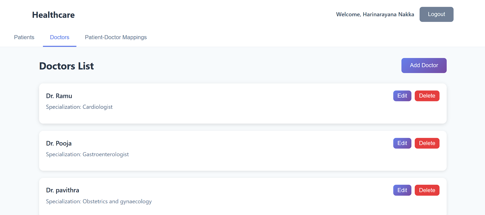
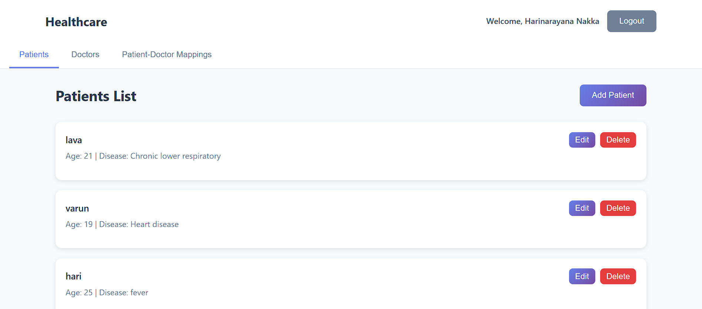

# WhatBytes ⚡

A simple **Healthcare** project built with **Node.js, PostgreSQL, and HTML/CSS**.  
This project helps manage doctors, patients, and appointments in a user-friendly way.

---

## 🚀 Features
- User authentication (Login/Register)
- Separate dashboards for **Doctors** and **Patients**
- PostgreSQL database integration
- Clean and simple UI

---

## 📷 Screenshots

### 🔑 Login Page

### 👨‍⚕️ Doctors Dashboard

### 🧑‍🤝‍🧑 Patients Dashboard

---

## 🛠️ Tech Stack
- **Frontend:** HTML, CSS, JavaScript  
- **Backend:** Node.js (Express)  
- **Database:** PostgreSQL  

